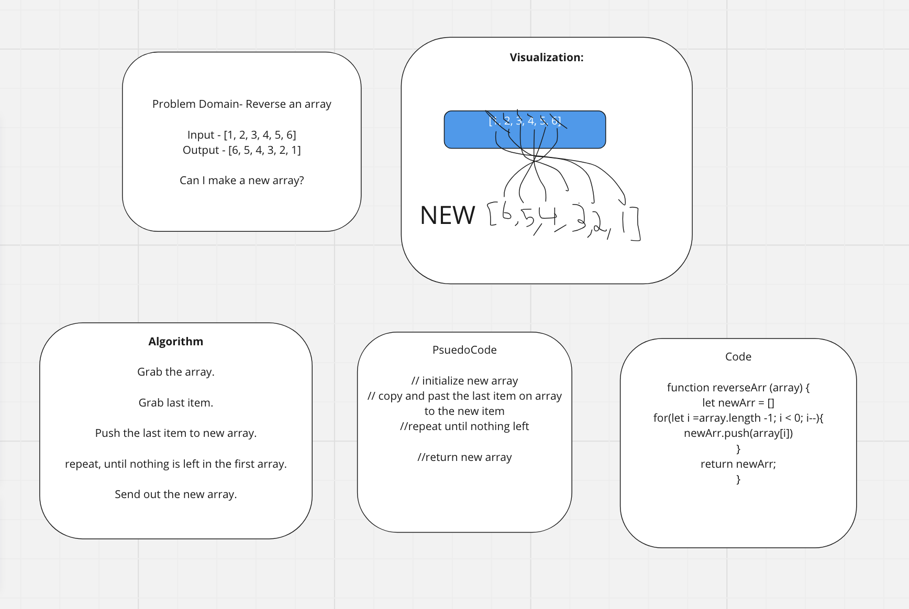

# Reverse an Array

## Whiteboard Process



## Approach & Efficiency

I went with a simple approach of iterating over the array in reverse and pushing
each element to a new array. Has a complexity of O(n).

## Solution

``` javascript
function resverseArr(arr) {
     let newArr = [];

     for (let i = arr.length - 1; i >= 0; i--) {
          newArr.push(arr[i]);
     }
     return newArr;
}
```
