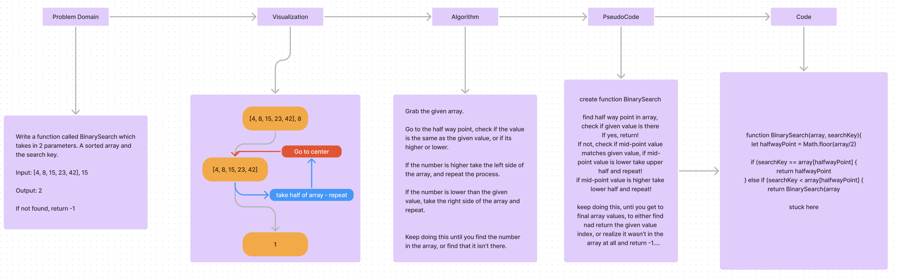

# Binary Search

> Write a function called BinarySearch which takes in 2 parameters: a sorted array
and the search key. Without utilizing any of the built-in methods available to your
language, return the index of the array’s element that is equal to the value of
the search key, or -1 if the element is not in the array.

## Whiteboard Process

## Approach & Efficiency

I tried to approach it by finding the middle of the array, checking if I magically
found the element, if not, I would check if the element is greater or smaller than
the middle element, and then I would repeat the process on the half of the array
that contains the element.

I'd either find the element or reach a point where the array is empty, in which case
I would return -1.

## Solution

I wasn't able to make my own solution work perfectly yet, but you can see in my
whiteboard process where I got stuck.
