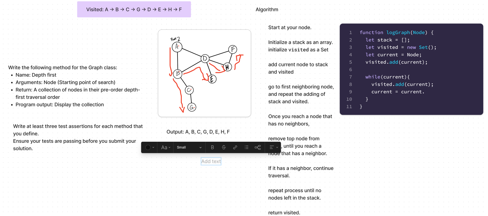

# Graph Depth First Traversal

- Name: Depth first
- Arguments: Node (Starting point of search)
- Return: A collection of nodes in their pre-order depth-first traversal order
- Program output: Display the collection

## Whiteboard Process

