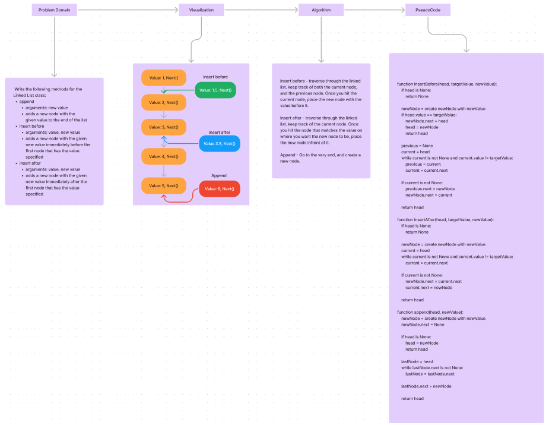
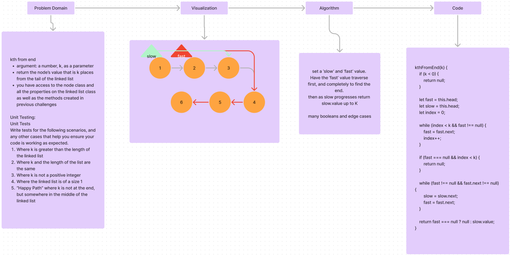
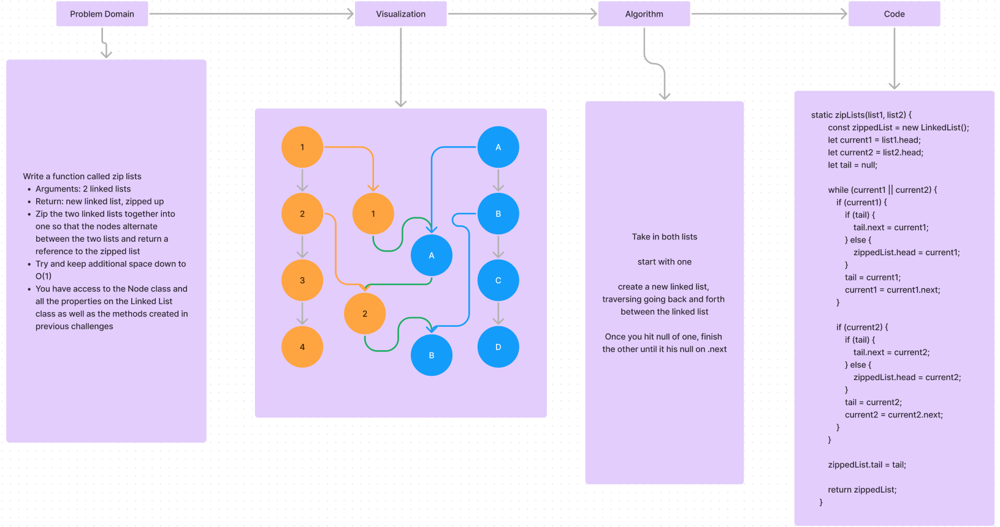

# Linked List

## Approach & Efficiency

We had a wonderful lecture going over linked lists and how they work. I was able
to follow along and understand the concepts. I was able to implement the linked
list and the tests with ease. I was able to get the tests to pass and the linked
list to work as expected.

## Tests

> npm test linked-list

## Challenges

### Append | Insert Before | Insert After

**WhiteBoard:**



**Aproach & Efficiency:**

This one was a bit tricky, and I ended up using help from AI. I think I understand
the solution, but I'll be watching some lectures on linked lists.

As for my efficiency, I think I did well. I was able to get the tests to pass
and the linked list to work as expected. I think the big O is O(n) for all of
these methods.

**Solution:**

```javascript

     //NOTE: Add new value to the tail
     append(value) {
          let node = new Node(value);
          if (this.head === null) {
               this.head = node;
          } else {
               let current = this.head;
               while (current.next !== null) {
                    current = current.next;
               }
               current.next = node;
          }
     }

     //NOTE: Add value within LinkedList
     insertBefore(targetValue, value) {
          let newNode = new Node(value);
          if (this.head === null) {
               return;
          }

          if (this.head.value === targetValue) {
               newNode.next = this.head;
               this.head = newNode;
               return;
          }

          let current = this.head;
          while (current.next !== null && current.next.value !== targetValue) {
               current = current.next;
          }

          if (current.next !== null) {
               newNode.next = current.next;
               current.next = newNode;
          }
     }

     insertAfter(targetValue, value) {
          let newNode = new Node(value);
          let current = this.head;

          while (current !== null && current.value !== targetValue) {
               current = current.next;
          }

          if (current !== null) {
               newNode.next = current.next;
               current.next = newNode;
          }
     }
```

### Kth From End

**WhiteBoard:**



**Approach & Efficiency:**

The solution I initially came up with was not working. I ran into the issue of thinking
I knew how to save the tail property. I ended up having to look up the solution.
I found this method to be interesting, although maybe not the most efficient. I think
the big O is O(n) for this method.

**Solution:**

```javascript
kthFromEnd(k) {
    if (k < 0) {
        return null;
    }

    let fast = this.head;
    let slow = this.head;
    let index = 0;

    while (index < k && fast !== null) {
        fast = fast.next;
        index++;
    }

    if (fast === null && index < k) {
        return null;
    }

    while (fast !== null && fast.next !== null) {
        slow = slow.next;
        fast = fast.next;
    }

    return fast === null ? null : slow.value;
}
```

### Zip Lists

**WhiteBoard:**



**Approach & Efficiency:**

I've gone through a couple different ones, but I wasn't able to meet all the requirements.
I decided to get help to better understand how this would work, and then I was told
about `static` methods. I was able to get the tests to pass and the linked list to
work as expected.

**Solution:**

```javascript
static zipLists(list1, list2) {
        const zippedList = new LinkedList();
        let current1 = list1.head;
        let current2 = list2.head;
        let tail = null;

        while (current1 || current2) {
            if (current1) {
                if (tail) {
                    tail.next = current1;
                } else {
                    zippedList.head = current1;
                }
                tail = current1;
                current1 = current1.next;
            }

            if (current2) {
                if (tail) {
                    tail.next = current2;
                } else {
                    zippedList.head = current2;
                }
                tail = current2;
                current2 = current2.next;
            }
        }

        zippedList.tail = tail;

        return zippedList;
}
```
