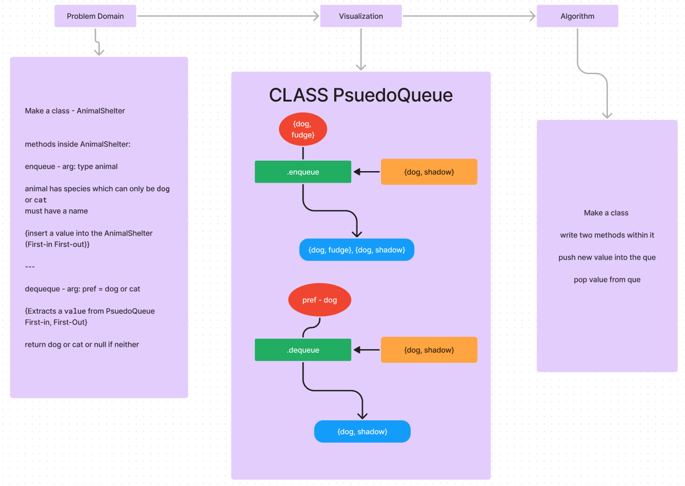

# Animal Shelter

>npm test queue

## Whiteboard Process



## Approach & Efficiency

I used an array as the queue and created a class AnimalShelter that has two methods.
Enqueue method that takes an animal object and adds it to the queue.
Dequeue method that takes a pref argument and returns the first animal in the queue
that matches the pref argument.

## Solution

```javascript
class AnimalShelter {
     constructor() {
          this.dogs = [];
          this.cats = [];
     }

     enqueue(animal) {
          if (animal.type === "dog") {
               this.dogs.unshift(animal);
          } else if (animal.type === "cat") {
               this.cats.unshift(animal);
          } else {
               return "We only accept dogs and cats";
          }
     }

     dequeueAny(pref) {
          if (pref === "dog" && this.dogs.length > 0) {
               return this.dogs.pop();
          } else if (pref === "cat" && this.cats.length > 0) {
               return this.cats.pop();
          } else {
               return null;
          }
     }
}

module.exports = AnimalShelter;
```
