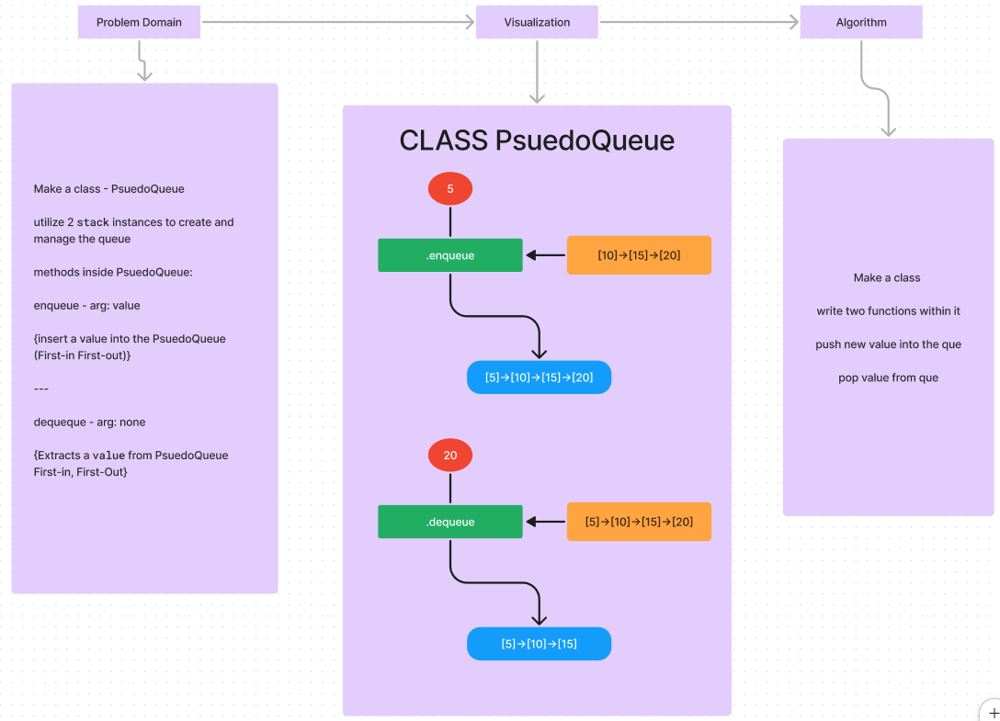

# Queue

## Whiteboard Process



## Approach & Efficiency

I don't know if it is allowed or not, but I simply used an array as the stack, and
used push and pop.

## Solution

```javascript
class PseudoQueue {
     constructor() {
          this.stack1 = [];
          this.stack2 = [];
     }

     enqueue(value, stack) {
          stack = [10, 15, 20];
          stack.unshift(value);

          return stack;
     }

     dequeue() {
          let stack = [5, 10, 15, 20];
          stack.pop(stack[-1]);

          return stack;
     }
}

module.exports = PseudoQueue;
```
