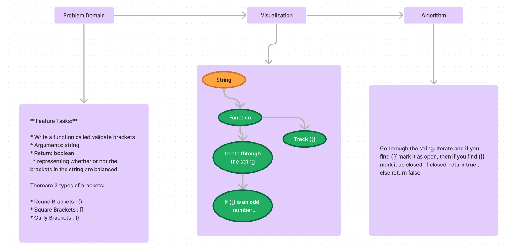

# Multi-Bracket Validation

**Feature Tasks:**

* Write a function called validate brackets
* Arguments: string
* Return: boolean
  * representing whether or not the brackets in the string are balanced

Thereare 3 types of brackets:

* Round Brackets : ()
* Square Brackets : []
* Curly Brackets : {}

## Whiteboard Process

## Approach & Efficiency

This methods within these classes are all O(1) time complexity.

## Solution

* [Code](./index.js)
