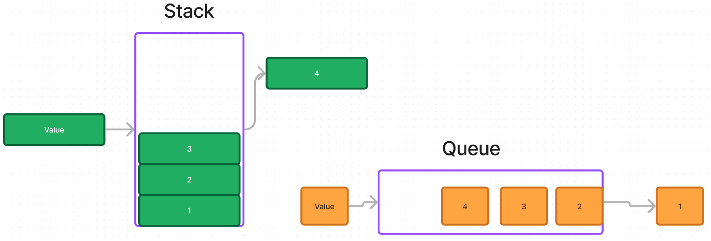

# Stacks and Queues

Using a Linked List as the underlying data storage mechanism, implement both a Stack and a Queue

## Whiteboard Process

## Approach & Efficiency

This methods within these classes are all O(1) time complexity.

## Solution

- [Code](./index.js)
