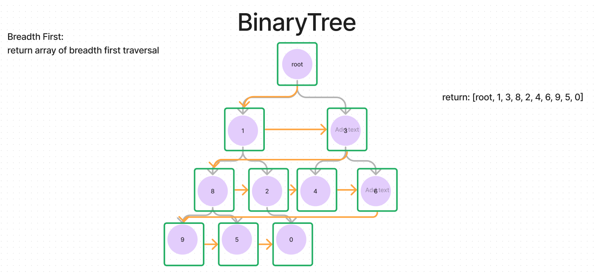

# Trees-Breadth First

- Write a function called breadth first
- Arugments: tree
- Return: list of all values in the tree, in the order they were encountered

## Whiteboard Process

## Approach & Efficiency

- Being that it is logging the values of the tree in a breadth first manner, the
time complexity is O(n) and the space complexity is O(1).

## Solution

- [Code](./index.js)
