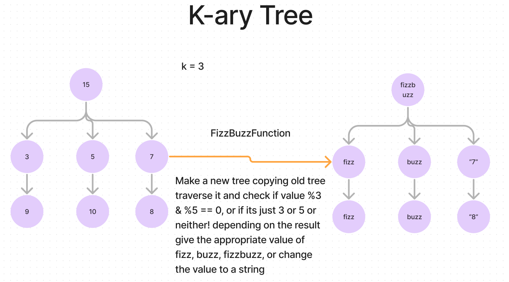

# Trees

- Write a function called fizz buzz tree
- Arugments: k-ary tree
- Return: new k-ary tree

## Whiteboard Process

## Approach & Efficiency

- The time complexity is O(n) and the space complexity is O(n).

## Solution

- [Code](./index.js)
