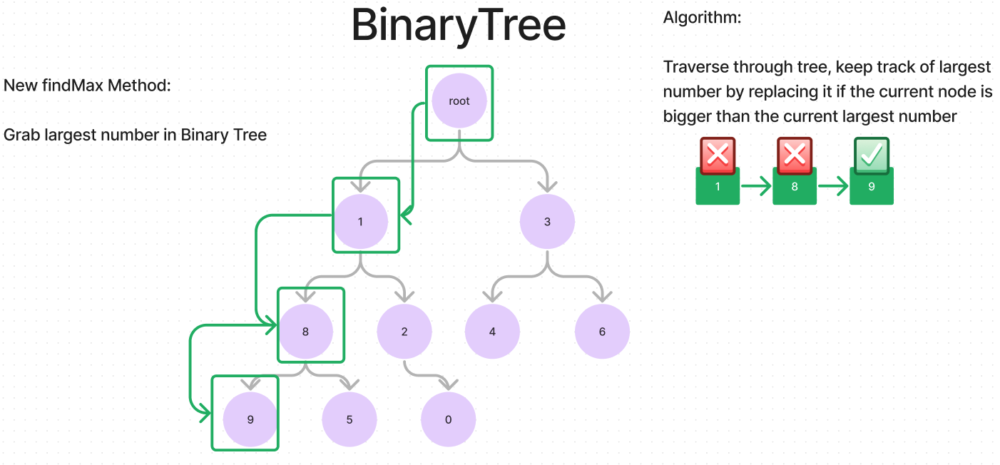

# Tree-Max

Write the following method for the Binary Tree class

- find maximum value
  - Arguments: none
  - Returns: number
    - Find the maximum value stored in the tree. You can assume that the values
    stored in the Binary Tree will be numeric.

## Whiteboard Process

## Approach & Efficiency

- Being that is the making of a tree, the time complexity is O(n) and the space
complexity is O(1).

## Solution

- [Code](./index.js)
